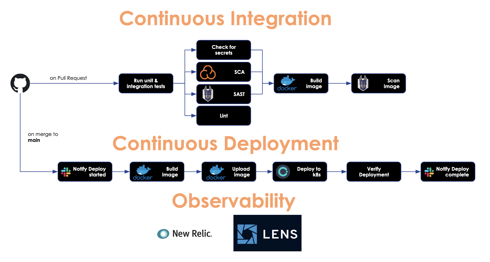

# Spring Boot API with GitHub Actions and Okteto 

This is an application providing Course management via REST calls.

## Prerequisites

Perform the following actions if you want to run the app in your own CI/CD context.

1. Fork this repository

### CI pipeline

2. [DockerHub](https://hub.docker.com/)
   - Create a DockerHub account (or log in if you have one)
   - Generate a DockerHub Token (My Account -> Security)
   - Define a GitHub SONAR_TOKEN Secret with the generated token (Settings -> Secrets)
3. [Sonarcloud](https://sonarcloud.io)
   - Create a Sonarcloud account (or log in if you have one)
   - Generate a Sonarcloud Token (Account Settings -> Security)
   - Define a GitHub DOCKERHUB_USERNAME Secret with your DockerHub usename
   - Define a GitHub DOCKERHUB_TOKEN Secret with the generated token (Settings -> Secrets)
4. [Snyk](https://app.snyk.io)
   - Create a Snyk account (or log in if you have one)
   - go to your [Snyk](https://app.snyk.io/account) account’s settings page and retrieve the API token.
   - Define a GitHub SNYK_TOKEN Secret with the generated token (Settings -> Secrets)


### CD pipeline
5. [Okteto](https://www.okteto.com/)
   - Create an Okteto account - _Login with GitHub_
   - Namespace with your GitHub username is created automatically, e.g. `mayamitova`
   - Define a GitHub `OKTETO_NAMESPACE` Secret with the created namespace
   - Generate an Okteto _Personal access token_ (Okteto -> Settings -> Personal Access Tokens -> New Token)
   - Define a GitHub `OKTETO_TOKEN` Secret with the generated Okteto token (Settings -> Secrets)
   - Install the Okteto CLI locally
   ```bash
     curl https://get.okteto.com -sSfL | sh
   ```
   - Download your Kubernetes credentials (https://www.okteto.com/docs/cloud/credentials/)
6. Create Kubernetes secretes for MySQL credentials
   ```bash
   kubectl create secret generic devops-course-db --from-literal=rootpasswordkey=<adminpwd> --from-literal=username=<dbuser> --from-literal=passwordkey=<dbuserpwd> --from-literal=database=devops-course-db
   ```
7. Create Kubernetes secretes for Newrelic credentials
   ```bash
   kubectl create secret generic devops-course-newrelic --from-literal=newreliclicense=<nrlicensekey>
   ```

### Notifications & Monitoring & Observability

### Coordinating Code Deploys and Continuous Integration in Slack

1. SLACK_WEBHOOK_URL (required)
   - Create a Slack Webhook URL using either the Incoming Webhooks App (preferred) or by attaching an incoming webhook to an existing Slack App (beware, channel override not possible when using a Slack App)
   - Define a GitHub SLACK_WEBHOOK_URL Secret with the generated webhook (Settings -> Secrets)
2. Add in workflow files :
   - env:
     SLACK_WEBHOOK_URL: ${{ secrets.SLACK_WEBHOOK_URL }}

3. See [https://github.com/act10ns/slack]

### Collect all your telemetry in one secure cloud New Relic

1. Create New Relic account (required)
   - Take license key
   - Create a secret with `kubectl create secret generic ...`
2. Download newrelic-agent : newrelic-agent-7.5.0.jar
3. Add configuration file newrelic.yml and start app with new relic agent.

## CI/CD Pipeline with GitHub Actions




